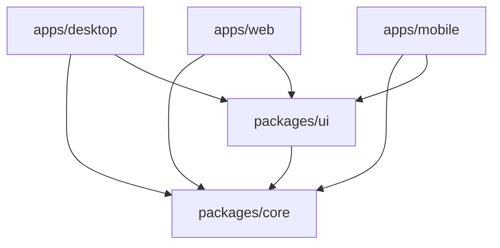

# Story2Video 前端技术文档

## 1. 项目概览

**Story2Video** 是一个跨平台的应用程序，利用 AI 将文本故事转化为视频。前端采用 **Monorepo** 架构，使用 **Turborepo** 和 **pnpm** 进行管理，在三个不同的应用程序之间共享核心业务逻辑和 UI 组件：

*   **Desktop:** Windows/macOS/Linux 桌面应用 (Tauri v2)。
*   **Mobile:** iOS/Android 移动应用 (React Native / Expo)。
*   **Web:** 浏览器端应用 (React)。

## 2. 架构设计

本项目遵循基于 Monorepo 结构的“整洁架构” (Clean Architecture) 思想。

### 高层依赖关系图

### 目录结构

| 路径 | 说明 |
| :--- | :--- |
| `apps/desktop` | Tauri v2 应用程序 (React + Rust)。 |
| `apps/mobile` | Expo 应用程序 (React Native)。 |
| `apps/web` | 单页应用程序 (React + Vite)。 |
| `packages/core` | **核心大脑**。包含共享的业务逻辑、API 客户端、状态管理和类型定义。与 UI 无关。 |
| `packages/ui` | **视觉外观**。共享组件库 (基于 Gluestack UI + NativeWind)。 |

## 3. 技术栈

*   **Monorepo 管理:** Turborepo
*   **包管理器:** pnpm
*   **编程语言:** TypeScript, Rust (用于 Tauri 后端)
*   **前端框架:** React 19 (Web/Desktop), React Native (Mobile)
*   **构建工具:** Vite (Web/Desktop), Expo (Mobile)
*   **样式方案:** Tailwind CSS (Web/Desktop), NativeWind (Mobile), Gluestack UI
*   **状态管理:** 
    *   **客户端状态:** Zustand (支持持久化存储)
    *   **服务端状态:** TanStack Query (缓存、轮询)

## 4. 共享包详解

### 4.1. 核心包 (`packages/core`)

该包包含应用程序的纯业务逻辑，完全不依赖于具体的 UI 框架。

#### 关键模块:

1.  **API 层 (适配器模式)**
    *   **接口 (`IHttpClient`):** 定义了所有 HTTP 请求的统一契约。
    *   **实现:**
        *   `createAxiosHttpClient`: 用于 Web 和 Mobile 的标准 HTTP 客户端。
        *   `createTauriHttpClient`: 用于 Desktop 的客户端，使用 Tauri 的 Rust HTTP 插件 (绕过 CORS)。
        *   `createMockHttpClient`: 拦截请求并返回模拟数据，用于开发和测试。
    *   **SDK (`createApi`):** 将底层 HTTP 客户端封装为领域特定的方法 (例如 `sdk.stories.create()`)。这充当了 **防腐层 (Anti-Corruption Layer)**，将 UI 组件与具体的 API 端点解耦。
    *   **Provider:** `ApiProvider` 通过 React Context 注入具体的客户端实现。

2.  **状态管理**
    *   **`useOperationsStore` (Zustand):** 管理客户端的持久化状态，专门用于跨会话跟踪“长时间运行的操作” (Long Running Operations，如视频生成)。使用自定义存储适配器，同时支持 Web (localStorage) 和 Mobile (AsyncStorage)。
    *   **QueryProvider (TanStack Query):** 配置全局 `QueryClient`，处理服务端数据的缓存和重新验证。

3.  **类型定义**
    *   共享的 TypeScript 接口，定义了领域模型 (如 `Story`, `Shot`, `Video`)。

### 4.2. UI 包 (`packages/ui`)

该包确保所有平台的视觉一致性。

*   **基础:** 基于 **Gluestack UI** 和 **NativeWind** 构建。
*   **GluestackUIProvider:** 一个包装组件，负责：
    *   注入 Gluestack 主题配置。
    *   管理 `OverlayProvider` (遮罩) 和 `ToastProvider` (提示消息)。
    *   同步 NativeWind 的颜色模式 (Light/Dark)。
*   **导出:** 重新导出 Gluestack 组件 (如 `Button`, `Box`, `Text`)，因此应用程序应从 `@story2video/ui` 导入，而不是直接从库中导入。

## 5. 应用程序详解

### 5.1. Desktop (`apps/desktop`)
*   **技术:** React 19 + Vite + Tauri v2。
*   **API 客户端:** 使用 `createTauriHttpClient` 通过 Rust 后端发起请求。
*   **特性:** 窗口管理，本地文件系统访问 (未来规划)，系统通知。

### 5.2. Mobile (`apps/mobile`)
*   **技术:** React Native + Expo Router。
*   **API 客户端:** 使用 `createAxiosHttpClient`。
*   **导航:** 基于文件的路由 (`expo-router`)。
*   **样式:** NativeWind 允许在原生视图上使用 Tailwind 类名。

### 5.3. Web (`apps/web`)
*   **技术:** React 19 + Vite。
*   **API 客户端:** 使用 `createAxiosHttpClient`。
*   **部署:** 针对 Vercel 优化的配置。

## 6. 开发工作流

### 前置条件
*   Node.js v18+
*   pnpm (`npm i -g pnpm`)
*   Rust (仅 Desktop 开发需要)
*   Android Studio / Xcode (仅 Mobile 开发需要)

### 常用命令

| 命令 | 说明 |
| :--- | :--- |
| `pnpm install` | 安装所有应用和包的依赖。 |
| `pnpm dev` | 启动 Web 和 Mobile 的开发服务器 (Desktop 需要单独命令)。 |
| `pnpm -F desktop tauri dev` | 在开发模式下启动 Desktop 应用。 |
| `pnpm -F mobile android` | 在 Android 模拟器上运行 Mobile 应用。 |
| `pnpm -F mobile ios` | 在 iOS 模拟器上运行 Mobile 应用。 |
| `pnpm build` | 构建所有应用。 |

### 环境变量配置

请根据 `.env.example` 在各应用目录下创建 `.env` 文件。

*   `VITE_API_BASE_URL` (Web/Desktop) 或 `EXPO_PUBLIC_API_BASE_URL` (Mobile): API 服务器地址。
*   `VITE_USE_MOCK` / `EXPO_PUBLIC_USE_MOCK`: 设置为 `true` 以使用内存中的 Mock API，无需后端。

## 7. 如何添加新功能

1.  **Core:** 在 `packages/core` 中添加类型定义和 API 方法。同步更新 Mock 客户端。
2.  **UI:** 如果需要，在 `packages/ui` 中创建或更新共享组件。
3.  **App:** 在具体应用 (`apps/web` 等) 中导入 hooks/组件并实现页面逻辑。
